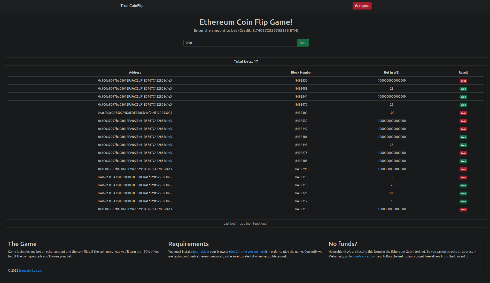

# Ethereum Coin Flip Game

A simple casino game based on the Ethereum blockchain, featuring a Solidity smart contract (CoinFlip.sol) and a web-based interface for interaction.

## Inspiration
Inspired by the [2017 Ethereum Coinflip](https://github.com/mariopino/ethereum-coinflip/) and helped with [2021 Polyroll](https://github.com/polyroll/polyroll-game-v2).

## How to Play
1. Install Metamask on your browser
2. Connect to the Goerli Ethereum test network in Metamask
3. Bet an amount of ether
4. Flip the coin and win 190% of your bet if it lands on heads, or lose your bet if it lands on tails.

## Getting Funds to Play
The DApp is currently running on the Goerli Ethereum testnet. You can create a Goerli account in Metamask and get free ether from [Goerli Faucet](https://goerlifaucet.com/).

## How it Works
The game uses Chainlink VRF for the coin flip. If the transaction's timestamp is an odd number, you win 190% of your bet. If it's even, you lose your bet. Currently, the initial version uses a timestamp which is vulnerable to manipulation. See [Ethernaut Coinflip level 3](https://ethernaut.openzeppelin.com/). 

## Installation
To run your own Ethereum coin flip instance:
1. Publish the Solidity smart contract using Ethereum Wallet/Mist or your preferred method and take note of the contract address.
2. Deposit funds to the contract using the contract function depositFunds().
3. Edit `js/coinflip.js` and replace the contract address in the header.
4. Upload the DApp files to a web server, or run it on the local file system.

## TODO
### UI
Check [Issues](https://github.com/YasuBlockchain/TrueCoinflip/issues) for updates.

### Smart Contract
Check [Issues](https://github.com/YasuBlockchain/TrueCoinflip/issues) for updates.
